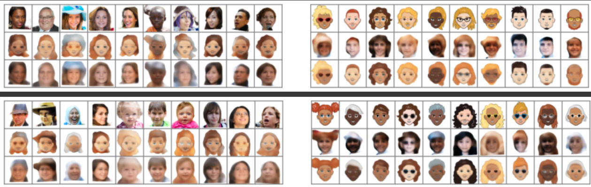

## Cycle GAN face to cartoon.
This is a project of Cycle GAN model used to convert person faces into their cartoon (unsupervised image to image generation) representations based on a work https://github.com/junyanz/pytorch-CycleGAN-and-pix2pix/tree/003efc4c8819de47ff11b5a0af7ba09aee7f5fc1

I have managed to achieve some visible results with converting faces to cartoons with slight modifications of original models architecture and apllying lower cycle and identity losses. Training was performed on 25000 images from each domain with a batch size = 50 for 130 epochs.

On the left you can see the results of generating cartoons to faces and back to faces(from top to bottom). On the right - opposite transformations.

